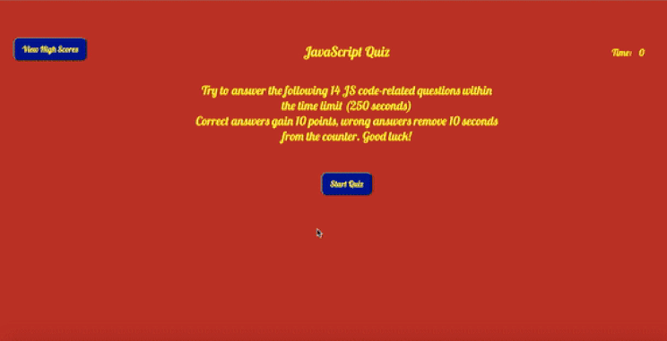

# JS-multi-choice-quiz

A challenging, timed quiz on the primary language used to build it: JavaScript.  

The main objective is to test the user's knowledge with multiple choice coding-related questions. Starting with 250 seconds on the timer, 14 questions are presented with 4 possible answers. 10 points are added for correct responses, while wrong answers deduct 10 seconds from the time limit. One is then taken to a high scores page which can be reset as desired.  

This application uses dynamically updated, responsive HTML and CSS powered by JS based on the following guidelines:

```
GIVEN I am taking a code quiz
WHEN I click the start button
THEN a timer starts and I am presented with a question
WHEN I answer a question
THEN I am presented with another question
WHEN I answer a question incorrectly
THEN time is subtracted from the clock
WHEN all questions are answered or the timer reaches 0
THEN the game is over
WHEN the game is over
THEN I can save my initials and my score
```

## Working links
* Repo : https://github.com/mz0121coder/JS-multi-choice-quiz
* Main URL: https://mz0121coder.github.io/JS-multi-choice-quiz

## Application Demo
